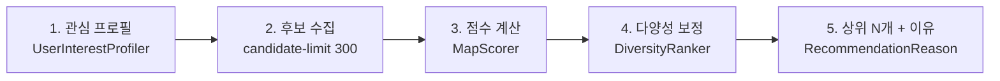
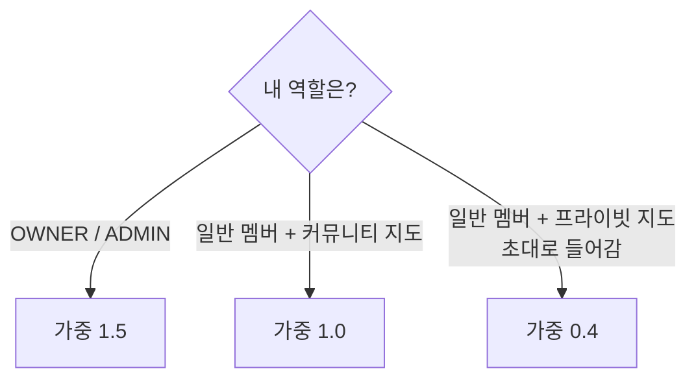
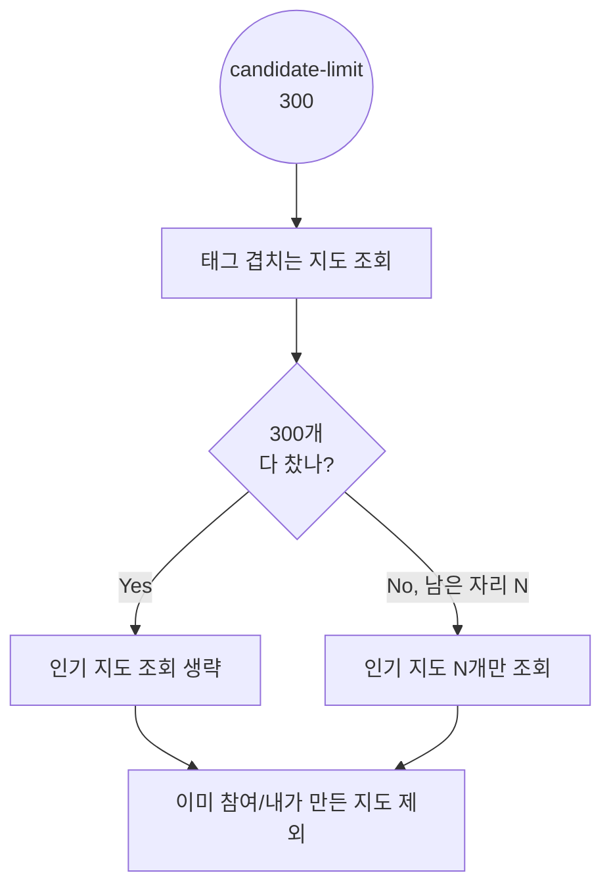

# 커뮤니티 지도 추천 (#66)

홈 화면 `OO님을 위한 추천 지도` 캐러셀에 지도 5개를 골라주는 기능.
`GET /api/v1/maps/recommendations?size=5` (map-service, 8083). 자세한 설정값·API 스펙은
[`map-service/.../recommendation/README.md`](../map-service/src/main/java/com/moamap/map/recommendation/README.md) 참고.
이 문서는 **구현 흐름 요약본**이다.

---

## 한 줄 요약

**"내가 참여한 지도의 태그"로 취향을 추론해, 태그가 비슷한 다른 커뮤니티 지도를 점수 매겨 추천한다.**
참여 이력이 없으면 인기·최신 지도로 대체한다 (빈 목록 금지).

---

## 전체 흐름



| 단계 | 담당 클래스 | 하는 일 |
|---|---|---|
| 1 | `UserInterestProfiler` | 참여 지도 태그 → 가중치 벡터 (`InterestProfile`) |
| 2 | `MapRecommendationService` | 태그 겹치는 지도 + (부족분) 인기 지도, DB 조회는 여기서만 |
| 3 | `MapScorer` | 후보마다 점수 매김 |
| 4 | `DiversityRanker` | 비슷한 지도만 뽑히지 않게 감점 |
| 5 | `RecommendationReason` | "관심 태그 #카페와 비슷해요" 같은 문구 생성 |

`UserInterestProfiler` / `MapScorer` / `DiversityRanker`는 DB·스프링에 안 붙는 **순수 계산 객체** — 단위 테스트가 빠르다.

---

## 1) 관심 프로필: 태그 가중치는 어떻게 매기나

```
태그 가중치 = 등장 횟수 × 신호 가중 × 최근성 가중(60일 반감기)
```



- 커뮤니티·프라이빗 지도 **모두 재료로 쓰지만**, 추천 결과로는 커뮤니티 지도만 나간다 → 비공개 정보 비노출.
- 초대로 들어간 프라이빗 지도는 "내가 고른 컨셉"이 아니라서 가중을 낮춘다 (0.4).

---

## 2) 후보 수집: 최대 300개로 고정



지도가 몇 만 개가 돼도 채점 대상은 항상 300개 이하 — 최근에 "태그 후보로 300 채워도 인기 쿼리를 또 300개 불러 실제론 600개였던" 버그를 고쳤다 (지금은 남은 자리만큼만 조회).

---

## 3) 점수 계산

```
점수 = 태그 유사도 × 0.55 + 인기도 × 0.25 + 신선도 × 0.20
```

| 요소 | 계산 | 이유 |
|---|---|---|
| 태그 유사도 | 관심 벡터 vs 지도 태그 **코사인 유사도** | 단순 겹침 개수는 "중요하게 여기는 태그"를 반영 못함 |
| 인기도 | `log(멤버 수)` 정규화 | 원본 값 쓰면 대형 지도가 다른 요소를 압도 |
| 신선도 | 생성일 지수 감쇠 (90일 반감기) | 오래된 지도만 계속 노출되는 것 방지 |

**콜드스타트(참여 이력 0건)** 는 태그 항목이 항상 0이라 별도 가중치를 쓴다 — 인기 0.80 / 신선도 0.20.
(처음엔 tag 몫 0.55를 나머지에 비례 배분했는데, 그러면 신선도 비중이 2.2배로 튀어 "많이 찾는 지도" 의도와 어긋나서 설정값으로 분리함.)

---

## 4) 다양성 보정

점수 순으로 그냥 자르면 **상위 5개가 전부 `#맛집`** 이 되기 쉽다. 하나씩 뽑을 때마다:

- 이미 고른 지도와 태그가 겹칠수록 감점 (`tag-overlap-penalty: 0.15`)
- 같은 소유자 지도는 **최대 1개**까지만 (`max-per-owner: 1`)

---

## 왜 이렇게 안 했나 (자주 나올 질문)

- **왜 배치로 미리 안 만들어두나?** → 참여 직후에도 실시간 반영돼야 해서. 배치면 "방금 참여한 지도가 계속 추천에 뜸" 문제 생김.
- **왜 캐시 없나?** → Redis 의존성이 map-service에 아직 없고, 지금 계산량(쿼리 3번 + 후보 수백 건 산술)에서 캐시는 이르다.
- **왜 LLM 안 쓰나?** → 요청 경로에 넣으면 응답 지연·비용이 사용자 수에 비례해 커진다. 태그 동의어 정리 같은 오프라인 배치 용도로는 검토 여지 있음.
- **설정 다 `application.yml`에 있는 이유** → 가중치 튜닝할 때마다 재배포 안 하려고.

---

## 알려진 한계 (다음에 할 일)

| 항목 | 상태 |
|---|---|
| IDF 없음 — `#맛집`처럼 흔한 태그가 변별력 없이 가중치 1위 | 미착수, 태그 확보율 개선 선행 필요 |
| 추천 이유 문구 조사 오류 (`#맛집와` → `#맛집과`) | 미착수 (시연 범위 제외) |
| 태그 정규화 백필 SQL | 신규 입력에만 적용됨, 기존 데이터 미실행 |
| 장소 신호(카테고리·지역), 조회 로그 기반 협업 필터링 | place-service 연동 필요, 미착수 |
